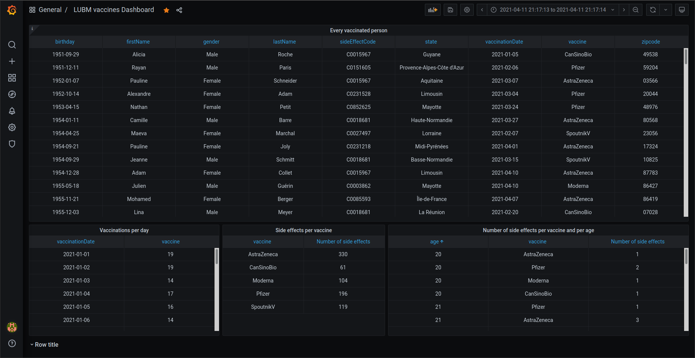

<!-- PROJECT LOGO -->
<br />
<p align="center">
  <a href="https://github.com/SaladTomatOignon/SAIR-RDF-Graph">
    
  </a>

  <h3 align="center">Data engineering student project</h3>

  <p align="center">
    Application based on RDF graph with fake data, that are distributed using Apache Kafka and displayed with Grafana
    <br />
    <a href="https://github.com/SaladTomatOignon/SAIR-RDF-Graph/tree/main/Documentation"><strong>Go to the documentation »</strong></a>
    <br />
    <br />
    <a href="https://github.com/SaladTomatOignon/SAIR-RDF-Graph/tree/Kafka-avro">Avro serdes version</a>
    ·
    <a href="https://github.com/SaladTomatOignon/SAIR-RDF-Graph/issues">Report bug</a>
  </p>
</p>


<!-- TABLE OF CONTENTS -->
<details open="open">
  <summary>Table of Contents</summary>
  <ol>
    <li>
      <a href="#about-the-project">About The Project</a>
    </li>
    <li>
      <a href="#getting-started">Getting Started</a>
      <ul>
        <li><a href="#prerequisites">Prerequisites</a></li>
        <li>
          <a href="#installation">Installation</a>
            <ul>
              <li><a href="#zookeeper">Zookeeper</a></li>
              <li><a href="#kafka">Kafka</a></li>
            </ul>
        </li>
      </ul>
    </li>
    <li><a href="#usage">Usage</a></li>
    <li><a href="#license">License</a></li>
    <li><a href="#authors">Authors</a></li>
  </ol>
</details>


<!-- ABOUT THE PROJECT -->
## About The Project

Student project based on LUBM RDF graph with extended data using symbolic AI and onthology. This data is randomly generated and represents informations about vaccinated persons with side effects.
Theses informations constitute records which are transformated and distributing into streams using Apache Kafka.
Finally theses records can be stored in database in order to be displayed with a vizualisation tool.


<!-- GETTING STARTED -->
## Getting Started

This section will show you how to execute the program.

### Prerequisites

Before getting started, you need to download a copy of the latest version of the repository :

```sh
git clone https://github.com/SaladTomatOignon/SAIR-RDF-Graph.git
```

In the following, it is assumed that you already have a running JDK on you machine.
You need to download a recent version of [Apache Zookeeper](https://www.apache.org/dyn/closer.cgi/zookeeper/) and [Apache Kafka](https://kafka.apache.org/downloads).

### Installation

#### Zookeeper

In the Zookeeper /bin directory, launch the server with the following command :

```sh
./zkServer.sh start
```

You should get the following line:
```
Starting zookeeper ... STARTED
```

#### Kafka

Once Zookeeper is working properly, go to the Kafka installation /bin directory and type :

```sh
./kafka-server-start.sh -daemon ../config/server.properties
```

This will start the Kafka server. You don't need to worry about topics creation since the program already does.

<!-- USAGE EXAMPLES -->
## Usage

Using SBT, compile the project with
```sh
sbt compile
```

It will download all dependencies of this application.

Then run it with
```sh
sbt run
```

Or you can use an IDE to build and run like IntelliJ.

___

Known issue : If you get "_File not found : lubm1.ttl_" message error at execution, then find the **LUBM1graph** class (_fr.uge.sair.graphs.LUBM1graph_) and edit the path to the lubm1.ttl file at line 91, which is located at _src/main/resources/lubm1.ttl_.

For instance, find this line :

```scala
val source: String = getClass.getResource("/lubm1.ttl").getPath
```

And edit it with a relative path :

```scala
val source: String = "src/main/resources/lubm1.ttl"
```
___

The program will show the generated records, consumed by the last topic, in an infinite loop.
Enter any value to kill the threads and to stop the program.

<!-- LICENSE -->
## License

Distributed under the MIT License. See `LICENSE` for more information.


<!-- AUTHORS -->
## Authors

* [MILED Amany](https://github.com/AmanyMld)
* [SANCHES FERNANDES Stéphane](https://github.com/steph-sanches)
* [WADAN Samy](https://github.com/SaladTomatOignon)
* [ZEMMOUR Axel](https://github.com/axel-zemmour)